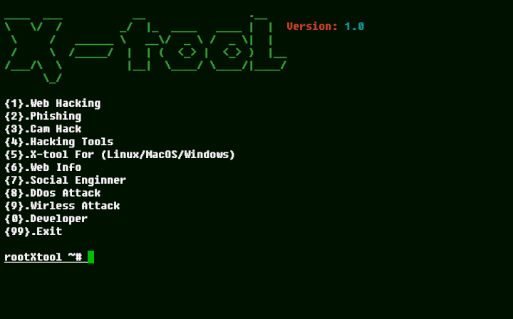

# X-tool


## introduction
This is a tool for hacking where there are many choices of tools that can be used

## Instalations
```
$ apt update
$ apt upgrade
$ pkg install git
$ pkg install python
$ pkg install python3
$ git clone https://github.com/Whomrx666/X-tool
$ cd X-tool
$ bash install.sh
$ python X-tool
```

## Instructions
- **First**: Install the tool according to the instructions above
- **Second**: You just have to choose what you want to do there, for example phishing or DDOS
- **Third**: Then choose what tools you want to use and just install them
- **Last**: After installing the tools, they will be automatically saved in your home directory and you just have to use them 
### Original Author
<a href="https://github.com/Whomrx666"></a>

Follow me: [Whatsapp](https://wa.me/6287855190571),[Youtube](https://youtube.com/@whomrx666),[Tiktok](https://www.tiktok.com/@whomr.x),[Facebook](https://www.facebook.com/whomrx.666),[Telegram](https://t.me/@Whomr_X),&[Website](https://whomrxhackers.blogspot.com/)

**If you want to donate, click on the button**
<a href="https://saweria.co/whomrx"></a>

